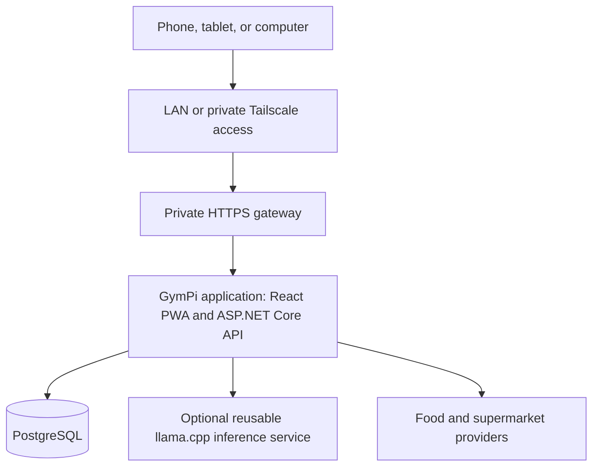
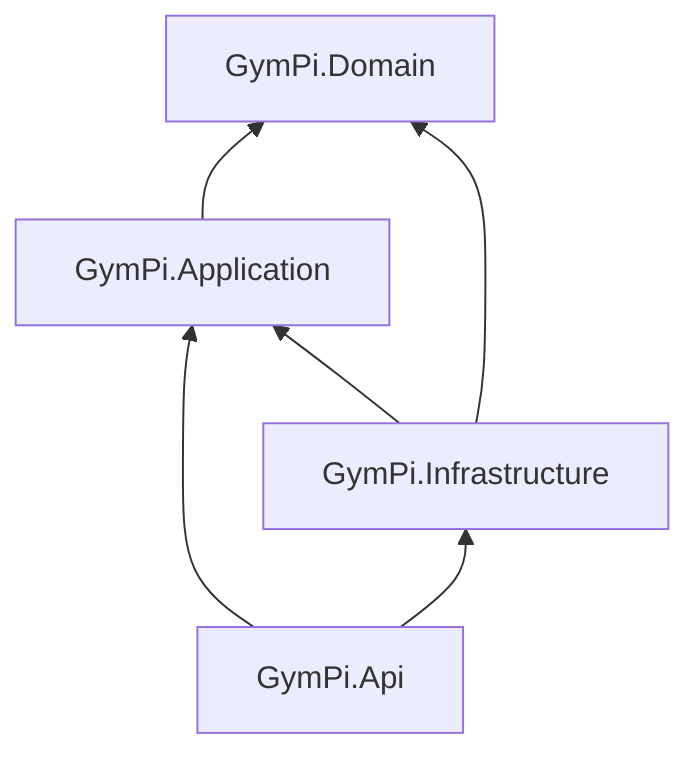

# GymPi system architecture

## Status and decisions

This document describes GymPi's approved system-level architecture. The durable decisions are recorded in:

- ADR 0001: local CPU AI for metrics and meals;
- ADR 0002: four backend project boundaries;
- ADR 0003: semantic design-token contract;
- ADR 0004: single-origin modular-monolith deployment;
- ADR 0005: reusable, database-blind local inference.

Authentication internals, the first PostgreSQL schema, offline conflict behaviour, and the private HTTPS gateway remain approval-gated decisions.

## Runtime topology

### GymPi application

The production React build and ASP.NET Core API share one origin. The ASP.NET Core process serves static PWA assets, exposes `/api` endpoints, hosts the composition root, integrates authentication, and runs only the bounded background work currently required.

Development may run Vite and ASP.NET Core separately for hot reloading. That development topology does not change the production contract.

### PostgreSQL

PostgreSQL is the authoritative datastore. Browser state, IndexedDB, external-provider caches, and model context cannot silently override it.

GymPi begins with one database, one migration history, and one transaction for each atomic use case. Business modules conceptually own their data even though they share the database.

### Reusable local inference

The optional inference process is outside GymPi's application and database boundaries. It loads the model and performs bounded generation. It has no database credentials, application tools, internet authority, or state-changing capability.

GymPi supplies a small authorised context containing verified facts and validates the response. Another Pi application may call the same service with its own context, rules, database, output contract, evaluations, and fallback. The inference service does not share conversations or application state, and routine telemetry excludes raw prompts, private context, and generated health content.

### External providers

Food and supermarket providers are outbound Infrastructure adapters. Their responses are treated as untrusted, validated, normalised, attributed to a source, and cached where appropriate. Core GymPi behaviour remains available when a provider is unavailable.

## Source-code dependency direction

### Domain

`GymPi.Domain` contains business concepts, invariants, value objects, deterministic policies, and domain behaviour. It does not reference HTTP, ASP.NET Core, EF Core, PostgreSQL, React, Tailscale, external providers, or local AI.

### Application

`GymPi.Application` contains explicit use cases. A use case receives input, loads the minimum authorisation context through an approved boundary, verifies the actor's permission, loads any remaining required state, invokes domain behaviour, persists the result, and returns an explicit outcome. Protected target data is not returned before authorisation succeeds.

Application owns GymPi-specific AI prompts, context construction, output schemas, validation, and deterministic fallback. It may define a narrow local-inference client contract because that contract protects a real process boundary.

### Infrastructure

`GymPi.Infrastructure` implements PostgreSQL persistence, authentication storage, password hashing, external providers, notifications, filesystem access where justified, and the local-inference client. It contains EF Core mapping so Domain types do not require EF Core attributes.

### API

`GymPi.Api` owns HTTP transport, request and response DTOs, request validation, authentication integration, cookies and security headers, exception-to-HTTP translation, dependency registration, process hosting, and production PWA serving. Endpoints translate transport concerns and do not contain GymPi business rules.

## Request lifecycle

For a normal state-changing request:

1. The React PWA sends an HTTPS request to the same-origin `/api` endpoint.
2. API establishes the authenticated identity and validates the transport contract.
3. Application starts the use case using that identity and the requested resource identifiers.
4. Infrastructure loads only the membership, ownership, or sharing state required for authorisation.
5. Application denies unauthorised access before protected target data is returned.
6. Infrastructure loads the remaining authoritative state required by the accepted use case.
7. Domain enforces invariants and performs deterministic behaviour.
8. Infrastructure persists the accepted change in a database transaction.
9. Application returns an explicit result.
10. API translates the result into an HTTP response DTO.

React cannot grant permission, API endpoints cannot bypass application authorisation, EF Core does not decide business policy, and domain entities are not exposed as public response contracts.

## Offline boundary

IndexedDB is a device-local cache and potential queued-work store, not an authoritative database. Offline writes require feature-specific synchronisation, idempotency, conflict, privacy, and recovery rules. Offline behaviour will be designed after the first online household and authentication slices rather than applied generically to every endpoint.

## Background work

Small scheduled operations initially use bounded ASP.NET Core hosted services. Durable state belongs in PostgreSQL; retries must not duplicate user-visible effects; failure must be observable; and optional work must not make core GymPi unavailable.

A broker, separate worker, distributed scheduler, or cache service requires measured need and another architecture decision.

## Deployment boundary

The intended Pi deployment contains:

- one GymPi application process or container;
- one PostgreSQL service with persistent storage;
- one optional bounded inference process or container;
- a private HTTPS gateway;
- Tailscale and Pi-hole as adjacent host services rather than GymPi code dependencies.

The exact gateway, storage layout, backup encryption, recovery objectives, and resource limits remain deployment decisions requiring separate approval and validation on the target Pi.

## Scalability boundary

GymPi scales first through clear module ownership, bounded queries, pagination, indexes, measured database plans, stateless API behaviour where practical, and resource budgets for background and AI work.

A future hosted multi-household platform would introduce a new trust and deployment model. V1 does not pre-install multitenancy, microservices, distributed messaging, or cloud infrastructure for that hypothetical future.

## Deliberately deferred

- Authentication mechanism, sessions, recovery, and shared-device behaviour.
- Exact owner and household permission model.
- First database schema.
- Private HTTPS gateway selection.
- Offline conflict algorithms.
- Public API or independent frontend releases.
- CQRS frameworks, MediatR, generic repositories, and event buses.
- A central AI gateway, tools, agents, RAG, or vector storage.
